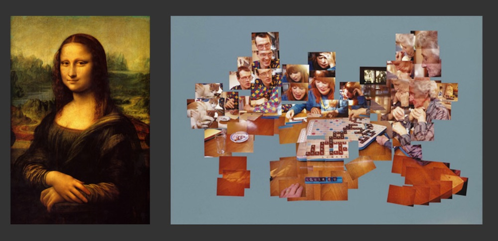
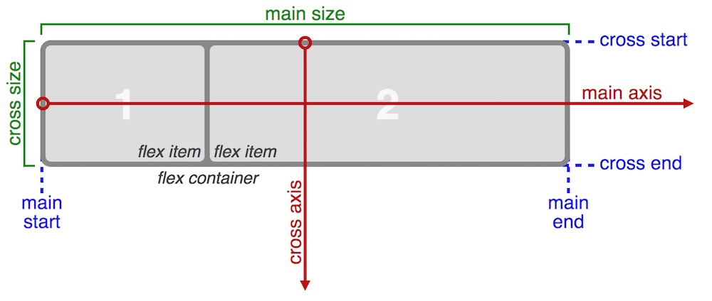
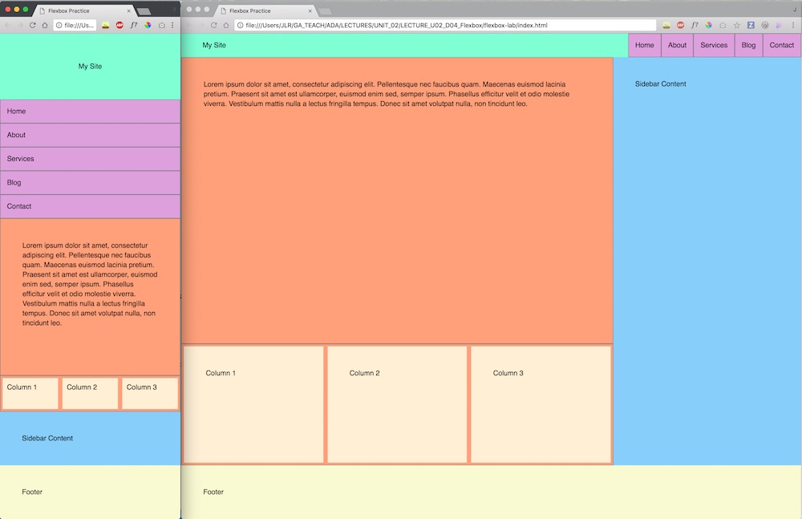

# Responsive Design & Flexbox!!

### Learning Objectives
- Describe responsive design
- Understand the differences between adaptive techniques and responsive design patterns
- Define the flexible box module (flexbox!)
- Give an example of a problem solved by flexbox
- Contrast flex containers and flex items
- Describe the difference between the main axis and the cross axis
- Use flexbox to solve common design problems without using hacks

# What is responsive design?

The term "responsive web design" was coined by Ethan Marcotte (a super cool guy all around) back in 2010. It immediately caught on, and it's been around ever since.

> Responsive web design is the approach that suggests that design and development should respond to the user’s behavior and environment based on screen size, platform and orientation. (From [Smashing Magazine](https://www.smashingmagazine.com/2011/01/guidelines-for-responsive-web-design/))

We've been doing this a little bit already! We've been using media queries to change how pages look between desktop and mobile. And by and large, this is what interviewers and job postings mean when they say "responsive design". But we're going to go a little bit deeper into the rabbit hole...

### What is a screen? What is a webpage?

Designing for screen is inherently different from designing for print, because of a concept that Frank Chimero (another super cool guy) calls "flux". Flux just refers for the ability for mutability -- the ability to change. By and large, print design doesn't have this, while it's natural and essential for the concept of the screen.

Originally web designers used to design for web the way they designed for print, which is why tables were such a big deal in the '90s and early '00s. And when screens were all more or less the same size, that was fine. But as soon as people started looking at the web on screens different sizes, things started breaking. It became clear that the way one thinks about designing for screen needed to change.

A webpage has no fixed dimensions. It extends potentially infinitely in every direction. Consider this definition of a webpage:

> An edgeless surface of unknown proportions comprised of small, individual, and variable elements from multiple vantages assembled into a readable whole. (from [The Web's Grain](https://www.frankchimero.com/writing/the-webs-grain/) by Frank Chimero)

Here's a visual to help us understand that concept a little more:



### Breakpoints or points of reassembly?? 🤔

Consider the common media query:

```css
@media screen and (min-width: 1025px) {
  /* stuff goes here */
}
```

Cool. So that's a media query for desktop view, for when the screen is larger than 1025px. We've put it there because our mobile design starts looking weird at that size.

So far, we've been calling these breakpoints. And you should be calling them breakpoints, because that's the industry standard term. But I find it more useful to think about these as "points of reassembly". 

Consider the definition of a page again:

> An edgeless surface of unknown proportions comprised of small, individual, and variable elements from multiple vantages assembled into a readable whole. (from [The Web's Grain](https://www.frankchimero.com/writing/the-webs-grain/) by Frank Chimero)

When we switch the screen from a desktop view from a mobile view, the elements aren't _breaking_. They're divs and spans and so on. They're immaterial. They can't break. They're _reassembling_.

The point of responsive design is to manage that reassembly in a way that benefits the user.

#### Adaptive design is _how_ you would change a page. Responsive design deals much more with _why_.

Nobody goes to a website to _use the website_. They go to the website to get information, perform a task, play a game, etc. (Remember writing user stories?) The easier we make that task for the user, the more likely the user is to stay on the page. 

#### The job of a designer or developer is to structure a page so that at any given moment, no matter the size of the screen or the device of the user, the user is seeing precisely the information they need most.

### But J! Why are we talking about design?!? This is a development course!

You are all designers.

Let's say that again:

#### _You are all designers._

Every one of you has designed an amazing game. But that's just scratching the surface of what design is, and what makes all of you designers. 

#### Design is approaching a problem with a creative lens in order to find a beautiful solution.

The concept of design -- and of designing responsively -- isn't just exclusive to considerations of visual design. It's about how you approach a problem: considering the _how_ of solving the problem as well as the _why_ of your approach. Thinking about your JavaScript in this way will help make you a better programmer, which is the real takeaway of this delve into responsive design.

### Common responsive design patterns

There are a number of common responsive web design problems. Frank Chimero goes over one in his article -- a picture and text next to each other with a changing screen size. We'll walk through a solution to that problem at the end of the lecture. In the meantime, [here's a link](https://bradfrost.github.io/this-is-responsive/patterns.html) to a site with a number of other common problems and solutions -- I recommend taking a look through it.

# Intro to flexbox!

#### What is flexbox?

Flexbox is short for "The CSS3 Flexible Box Module". From [MDN](https://developer.mozilla.org/en-US/docs/Web/CSS/CSS_Flexible_Box_Layout/Using_CSS_flexible_boxes), here's a definiton:

> Flexbox ... is a layout mode providing for the arrangement of elements on a page such that the elements behave predictably when the page layout must accommodate different screen sizes and different display devices. ... The defining aspect of the flex layout is the ability to alter its items' width and/or height to best fit in the available space on any display device.

### Flex context vs block context

- Up to this point we've been working with the block context -- `display: block;`. This means that in order to position things, we needed to float them, use clearfix, etc.
- Flexbox introduces a new context: `display: flex;`.
- Elements with `display: flex;` have, largely, an external block context -- they exist in the document flow like any other kind of element.
- Internally, they create a new type of context that has its own properties.

## Flex containers and flex items

### A flex _container_ is an element that creates a flex context.

#### Follow along in ✨ [this codepen!](https://codepen.io/jlr7245/pen/rmxKgL?editors=1100) ✨

From the [W3 Specification](https://www.w3.org/TR/css-flexbox-1/#flex-containers): 

> A flex container establishes a new flex formatting context for its contents. This is the same as establishing a block formatting context, except that flex layout is used instead of block layout. For example, floats do not intrude into the flex container ... Flex containers form a containing block for their contents exactly like block containers do.

The flex context works a little differently from the ordinary block context that is the default of the document flow. A number of properties are different or do not apply.

- `float` and `clear` don't have any effect on flex items
- `vertical-align` has no effect on a flex item
- Some pseudoelements, like `::first-line` and `::first-letter`, don't apply to flex containers.

### A flex _item_ is an element that exists within a flex context.

#### Keep following along in ✨ [this codepen!](https://codepen.io/jlr7245/pen/rmxKgL?editors=1100) ✨

From the [W3 Specification](https://www.w3.org/TR/css-flexbox-1/#flex-items): 

> Each in-flow child of a flex container becomes a flex item, and each contiguous run of text that is directly contained inside a flex container is wrapped in an anonymous flex item. 

### Nesting flex contexts within flex contexts (flexception....?? )

#### Follow along in ✨ [this new codepen!](https://codepen.io/jlr7245/pen/pPgZwb?editors=1100) ✨

From the [W3 Specification](https://www.w3.org/TR/css-flexbox-1/#flex-items): 

> A flex item establishes a new formatting context for its contents. The type of this formatting context is determined by its display value, as usual. However, flex items themselves are flex-level boxes, not block-level boxes: they participate in their container’s flex formatting context, not in a block formatting context.

## Flex Properties and Axes (axises? axes?)

There's a long list of CSS properties that are specific to either flex containers or flex items. We'll go through a few of them, and then you'll get practice with the rest during lab.

#### Follow along in ✨ [this codepen!](https://codepen.io/jlr7245/pen/MmKqxz?editors=1100) ✨

### Main Axis, Cross Axis

A lot of the power in flexbox comes from the ability to switch which axis is which with just one property.



### 📚 Flex Container Properties

([Taken largely from CSSTricks complete guide to flexbox.](https://css-tricks.com/snippets/css/a-guide-to-flexbox/))

<dl>
  <dt><code>display</code></dt>
  <dd>In order to create a flex context, you must declare it using <code>display: flex;</code>. (Note: You may also occasionally see <code>display: inline-flex;</code> but I have not had to use this. If you want to know what it does, I encourage you to mess around.)</dd>
  
  <dt><code>flex-direction</code></dt>
  <dd><code>flex-direction</code> establishes which axis is the main axis and which is the cross axis. The possible values are <code>row</code>, <code>row-reverse</code>, <code>column</code>, and <code>column-reverse</code>. The behavior of other properties are dependent on <code>flex-direction</code>.</dd>
  
  <dt><code>flex-wrap</code></dt>
  <dd>By default, flex items all try to fit into one line. <code>flex-wrap</code> changes this behavior, allowing items to wrap to new lines. The possible values are <code>nowrap</code>, <code>wrap</code>, <code>wrap-reverse</code>.</dd>
  
  <dt><code>flex-flow</code></dt>
  <dd>A shorthand property for <code>flex-direction</code> and <code>flex-wrap</code>. The default value is <code>row nowrap</code>. There's a bunch of different possible values -- essentially, pick one <code>flex-direction</code> value and one <code>flex-wrap</code> value and combine them.</dd>
  
  <dt><code>justify-content</code></dt>
  <dd>Defines the alignment and spacing along the main axis, and helps distribute extra, leftover free space. The possible values are <code>flex-start</code>, <code>flex-end</code>, <code>center</code>, <code>space-between</code>, and <code>space-around</code>. <a href='https://css-tricks.com/snippets/css/a-guide-to-flexbox/#article-header-id-6' target='_blank'>See CSS Tricks article for reference</a>.</dd>
  
  <dt><code>align-items</code></dt>
  <dd><code>align-items</code> describes how flex items are placed relative to the flex container. The possible values are <code>flex-start</code>, <code>flex-end</code>, <code>center</code>, <code>stretch</code> (the default), and <code>baseline</code>.</dd>
  
  <dt><code>align-content</code></dt>
  <dd>This aligns a flex container's lines when there's extra space on the cross axis. The available values are <code>flex-start</code>, <code>flex-end</code>, <code>center</code>, <code>stretch</code> (the default), <code>space-between</code>, and <code>space-around</code>. <b>NOTE!</b> This property has no effect unless there's more than one line of flex items.  </dd>
</dl>

### 📚 Flex Item Properties

([Taken largely from CSSTricks complete guide to flexbox.](https://css-tricks.com/snippets/css/a-guide-to-flexbox/))

<dl>
  <dt><code>order</code></dt>
  <dd>The order in which you want flex items to appear along the main access. The default is 0. Negative numbers are allowed.</dd>
  
  <dt><code>flex-grow</code></dt>
  <dd>Defines the proportion of the space in the container that the flex item will take up. For ex, if all flex items in a flex container have a <code>flex-grow</code> property of 1, they will all take up equal width. If one of the children has <code>flex-grow: 2;</code>, it will be twice as wide as the others.</dd>
  
  <dt><code>flex-shrink</code></dt>
  <dd>Defines the ability for a flex item to shrink if necessary.</dd>
  
  <dt><code>flex-basis</code></dt>
  <dd>Defines the default size of an element. You can use any CSS unit of measurement -- percent, pixels, em, etc.</dd>
  
  <dt><code>flex</code></dt>
  <dd>This is a shorthand property that combines <code>flex-grow</code>, <code>flex-shrink</code>, and <code>flex-basis</code>. It's recommended to use <code>flex</code> instead of setting the other properties individually. You have to include <code>flex-grow</code>, but the other two parameters are optional. Usually you'll include <code>flex-grow</code> and <code>flex-basis</code>, like this: <code>flex: 1 300px;</code>.</dd>
  
  <dt><code>align-self</code></dt>
  <dd>This allows the default alignment (as set by <code>align-items</code>) to be overridden for individual items.</dd>
</dl>

## 🚀 Lab 1: [Flexbox Froggy](http://flexboxfroggy.com/)! 🐸

For this lab, you'll be getting more acquainted with the flex properties, and applying them to flex items and flex containers. Hit the link above and start helping the frogs find their lilypads! (Feel free to work in pairs or groups!!)

# Why use flexbox?

As you may have noticed, ***flexbox is literally magic***. Problems that take hours of messing with floats, positions, and so on, are solved in minutes. And responsiveness is a dream -- just change the `flex-direction` between mobile and desktop and you're all set.

There are a number of classic web design problems that once took odd CSS hacks and patches to fix, but are now a breeze with flexbox. Let's walk through one of them together.

### 🏆 The Holy Grail

You've seen the Holy Grail layout about a billion times. It looks like this:


To put this image into words, the Holy Grail layout:

1. Has a fluid center (i.e. the center column changes width as the browser window changes width) and fixed-width sidebars, all of which are the same height;
2. Allows the center column to appear first in the HTML;
3. Allows any column to have the most content;
4. Has fixed-height header and footer that span the width of the page;
5. Has a footer that reaches at least the bottom of the browser window no matter the height of the content without using absolute or fixed positioning;
6. Requires only one extra element; and
7. Uses as little CSS as possible.

(This is based on the description of the Holy Grail problem from [A List Apart](https://alistapart.com/article/holygrail).)

We're going to be working from this HTML:

```html
<body>
  <header>Header</header>
  <main>
    <article>Content</article>
    <aside class='left'>Left sidebar</aside>
    <aside class='right'>Right sidebar</aside>
  </main>
  <footer>Footer</footer>
</body>
```

<details>
<summary>Here's the CSS solution. Don't peek!!! We'll walk through it together. But I wanted you to have it in case you want to come back to it later.</summary>

```css
body {
  display: flex;
  flex-direction: column;
  min-height: 100vh;
}

header, footer {
  flex: 0 150px;
}

main {
  flex: 1;
  display: flex;
}

article {
  order: 2;
  flex: 3;
}

aside {
  flex: 0 300px;
}

.left {
  order: 1;
}

.right {
  order: 3;
}

@media screen and (max-width: 1025px) {
  main {
    flex-direction: column;
  }

  article {
    order: 0;
  }

  aside {
    flex: 0;
  }
}
```
</details>

#### But J! How would you do this without flexbox!

I thought about walking through the flexboxless solution for the Holy Grail layout. But the fix without flexbox is so genuinely awful and contains so many practices that I'd like to avoid that it's really not worth even presenting. 

And there's one element of the problem the way I've presented it -- "5. Has a footer that reaches at least the bottom of the browser window no matter the height of the content without using absolute or fixed positioning" -- that might actually be impossible without flexbox.

If you're interested in the equal-height-columns problem, which is a classic CSS problem that I've had to use JavaScript to solve in the past (not ideal!), check out [this extremely ancient article](http://www.positioniseverything.net/articles/onetruelayout/equalheight) from 2005.

And here's a quick snippet of part of the flexboxless solution for Holy Grail:

```css
main {
  overflow: hidden;
}
main aside, main article {
  padding-bottom: 20010px;  
  margin-bottom: -20000px;  
}
footer {
  position: relative;
}
```

Yikes!!!!!!

## 🚀 Lab 2: Practice practice practice!

In the `flexbox-lab` directory of this repo, you'll find an `index.html` and a `style.css`. Using flexbox properties, get the `index.html` to look like this image, both on mobile widths and desktop widths:



There's a little bit of starter CSS provided.

Here's the lab solutions for each step. **ONLY LOOK AT THESE IF YOU ARE WELL AND TRULY STUCK!!!** And ***DO NOT*** copy and paste!!!! Add each property one at a time and see how the page changes! 

<details>
  <summary>Body</summary>

  ```css
    body {
        min-height: 100vh;
        display: flex;
        flex-direction: column;
    }
  ```

</details>

<details>
  <summary>Header and nav</summary>

  ```css
    header {
        display: flex;
        flex-direction: column;
    }

    .logo {
        flex: 0 150px;
        display: flex;
        justify-content: center;
        align-items: center;
    }

    @media screen and (min-width: 1025px) {
        header {
            flex-direction: row;
            justify-content: space-between;
        }

        nav ul {
            display: flex;
        }
    }
  ```

</details>

<details>
  <summary>Main, aside, content section, article</summary>

  ```css
    main, article {
        flex: 1;
        display: flex;
        flex-direction: column;
    }

    .content {
        flex: 2;
    }

    @media screen and (min-width: 1025px) {

        main {
            flex-direction: row;
        }

        aside {
            flex: 1;
        }

        article {
            flex: 3;
        }
    }
  ```

</details>

<details>
  <summary>Feature</summary>

  ```css
    .feature {
        flex: 1;
        display: flex;
    }

    .col {
        flex: 1;
    }
  ```

</details>